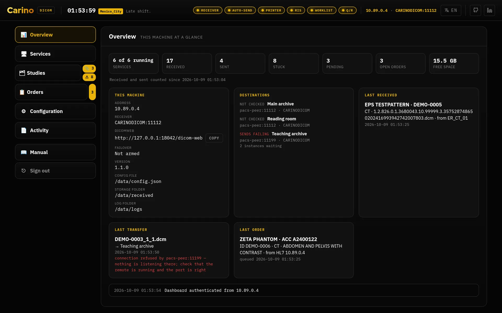
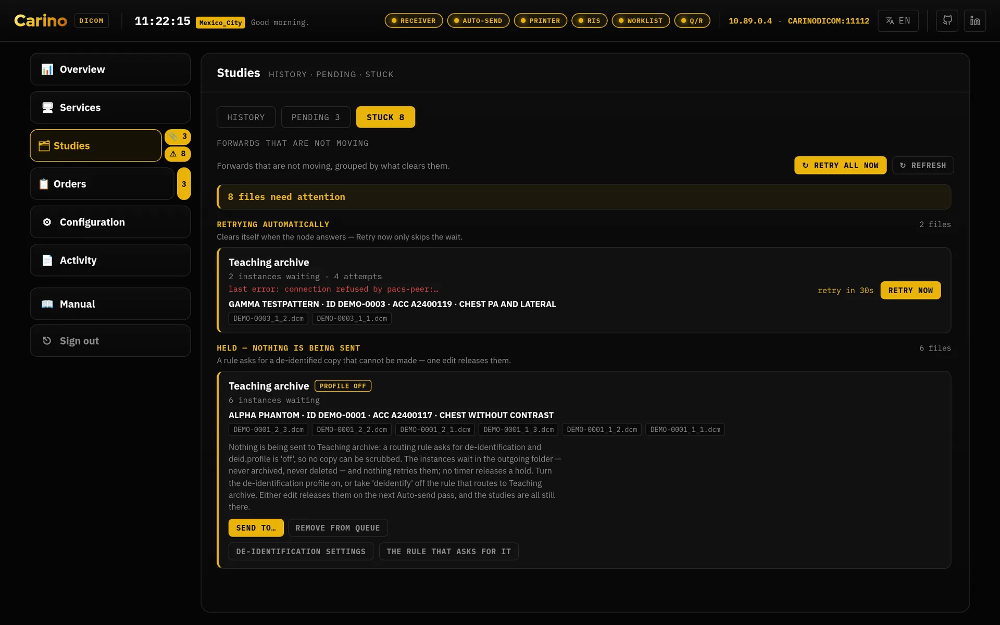
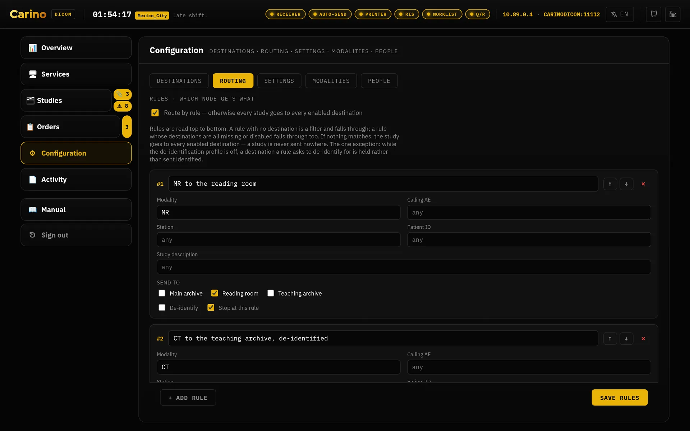

# Carino DICOM

A **DICOM gateway and continuity appliance**: one box, in one department, that
keeps imaging moving when something upstream breaks, and that talks to the
equipment nothing else will.

It receives and forwards studies, captures modalities that can only *print*,
serves a worklist, takes HL7 orders and matches them to the studies that come
back, answers Query/Retrieve and DICOMweb, and takes over when the primary PACS
goes down. You configure it with one JSON file and a local dashboard. It is meant
for a technologist or an IT generalist, not a PACS engineer.

**[dicom.carino.systems](https://dicom.carino.systems)** · [Manual](https://dicom.carino.systems/manual/)



> **Not a medical device, and not for primary diagnosis.** Read
> [Regulatory and safety](#regulatory-and-safety) before deploying it anywhere
> near patients.

## Who this is for

- **A modality that can only print.** Carino pretends to be the laser imager,
  captures the film, and turns it into a PDF or a Secondary Capture object that
  you identify and forward like any other study.
- **A department typing accessions by hand.** Carino takes HL7 orders, or lets
  you key them in by hand, serves them to the modality as a worklist, and
  matches the study back to its order when it arrives.
- **The primary PACS just went down.** Carino notices, offers to take over the
  worklist so scanning can continue, holds every study received during the
  outage, and sends them on once the primary is back.

**When to use something else:** [Orthanc](https://www.orthanc-server.com/) and
[dcm4chee](https://www.dcm4che.org/) are mature, free and better supported. Use
one of them if you need a long-term archive, LDAP/SSO, a plugin ecosystem, a
viewer, certification or a support contract. The two approaches work together:
Carino usually sits in front of Orthanc or dcm4chee as the gateway, and the
archive stays the archive.

## Quick start

### Docker

```bash
git clone https://github.com/MiguelCarino/Carino-DICOM.git
cd Carino-DICOM
mkdir -p data
echo "PACS_UID=$(id -u)" >> .env
echo "PACS_GID=$(id -g)" >> .env
docker compose up -d --build
docker compose logs -f pacs        # the dashboard token is printed once, on first boot
```

Open <http://127.0.0.1:8042/> and paste the token. By default everything is on
loopback, so nothing is published to your network. Set `PACS_BIND` so modalities
can reach the DICOM port, and `PACS_SERVICES` to choose which listeners start.
The comments in `docker-compose.yml` explain each setting.

### Podman (Fedora, RHEL, Rocky)

```bash
mkdir -p ~/CarinoDICOM
podman build --format docker -t carino-dicom:local .
install -Dm644 packaging/podman/carino-dicom.container \
        ~/.config/containers/systemd/carino-dicom.container
systemctl --user daemon-reload
systemctl --user start carino-dicom
journalctl --user -u carino-dicom -f     # the token prints on first boot
```

This sets it up as a rootless Quadlet unit, managed by systemd like any other
service. See [`packaging/README.md`](packaging/README.md#linux-podman-rootless).

### From source

```bash
./setup.sh          # creates .venv and installs dependencies (Windows: .\setup.ps1)
./run.sh init       # writes ~/CarinoDICOM/config.json
./run.sh serve      # dashboard at http://127.0.0.1:8042
```

Requires **Python 3.10+** (Debian/Ubuntu also need `python3-venv`). A fresh
install starts with no listeners on. The dashboard asks which services this
machine should run, and no DICOM port opens until you choose.

### Prove it works

You don't need a modality to test it. `pynetdicom` comes with the client tools,
and `pydicom` comes with a sample CT image:

```bash
./run.sh receive --port 11112                                  # or tick Receiver in the dashboard
python3 -m pynetdicom echoscu 127.0.0.1 11112 -v               # is it alive?
DCM=$(python3 -c "from pydicom.data import get_testdata_file; print(get_testdata_file('CT_small.dcm'))")
python3 -m pynetdicom storescu 127.0.0.1 11112 "$DCM" -v       # Status: 0x0000 - Success
```

The study appears in the dashboard right away, and on disk under
`~/CarinoDICOM/received/<patient>/<study>/<series>/`.

## What it does

Every service that opens a port is **off by default**. Each one can run from the
dashboard or from the command line without the dashboard.

| Service | Default port | Default AE | Config section |
|---|---|---|---|
| Dashboard + DICOMweb | 8042 (loopback) | — | `web`, `dicomweb` |
| Storage SCP (C-STORE / C-ECHO) | 11112 | `CARINODICOM` | `scp` |
| Virtual print receiver | 11113 | `CARINOPRINT` | `print` |
| Modality Worklist SCP | 11114 | `CARINOMWL` | `mwl` |
| Query/Retrieve SCP | 11115 | `CARINOQR` | `qr` |
| Emergency RIS (HL7 over MLLP) | 2575 | — | `ris` |
| Auto-send (outbound, no listener) | — | `CARINOSCU` | `scu` |

- **Receive and store:** accepts every storage class and transfer syntax and
  stores objects **as received**. Nothing is ever transcoded. It filters by
  calling AE, and stops accepting new images when free disk space drops below
  `scp.min_free_gb`.
- **Forward, with rules:** watches a folder and sends each stable file to its
  destinations. Delivery is tracked per destination, failures retry with
  backoff, and progress survives a restart. Routing rules match on modality,
  AE, station, patient ID or description. If no rule applies, the study goes to
  **every** destination, because a study must never end up going nowhere.
  *Explain route* shows which rule a study would hit.
- **De-identify on forward:** `basic` (PS3.15 Annex E) or `strict`. Only the copy
  that leaves is changed; the stored original is never rewritten. Pseudonyms are
  HMAC-derived, so set `deid.secret`. **Text burned into the pixels is not
  removed**, so someone still has to look at the images.
- **Query/Retrieve and DICOMweb:** C-FIND/C-MOVE/C-GET and QIDO/WADO/STOW, both
  answered from one SQLite index. A retrieve reports missing files as failed
  sub-operations rather than under-counting. Rendering and transcoding requests
  get a `406` instead of an approximation.
- **Virtual print receiver:** captures films from print-only modalities as a PDF
  or Secondary Capture. A film carries no structured identity, so it waits in
  **Pending** for an operator to identify it and is never forwarded
  automatically. *Send a test print* checks the whole path.
- **Emergency RIS and worklist:** receives HL7 `ORM^O01` orders or lets you key
  them in, serves them as a Modality Worklist, and closes each order when its
  study arrives. Images are sent whether or not a matching order exists. The
  **worklist probe** asks the real RIS what a modality would ask, which helps
  find why a scanner sees an empty list.
- **Emergency failover:** checks the primary PACS with C-ECHO. If it stays down,
  Carino offers to start the local worklist, holds incoming studies, and
  back-fills the primary once it answers. You choose who may activate failover
  and who gets told about it, with optional webhook and e-mail alerts.
- **People, permissions and audit:** profiles are optional. Each profile has its
  own permissions, checked by the server, and you choose per field which patient
  details it may see. The audit trail is append-only and hash-chained.
- **Non-DICOM ingest:** PDFs and images found next to a study become real
  Encapsulated PDF or Secondary Capture objects. Their identity is copied from
  the study, never guessed.
- **Bundled tag editor:** the offline [Carino DICOM Editor](https://dcm.carino.systems)
  is served at `/editor/`. It edits tags only and is not a diagnostic viewer.



### Held, not sent

This is the one exception to "never goes nowhere". A rule may require
de-identification for a destination when the scrub can't be done. When that
happens, Carino does not send that destination an identified copy. The
destination is **held** instead:

| `hold_cause` | What is wrong | What to do |
| --- | --- | --- |
| `profile-off` | A rule asks for de-identification but `deid.profile` is `off`. | Turn the profile on, **or** remove `deidentify` from the rule. |
| `no-deidentifier` | The profile is on, but no de-identifier could be built from the settings. | Fix the de-identification settings. The send channel in the log names the error. |

The study stays in the outgoing folder and every other destination still gets
it. The hold appears in the log, under ⚠ **Stuck**, and in *Explain route*.
Nothing releases a hold automatically. Turning the profile *off* does not
release a `no-deidentifier` hold.



## Maturity

| Area | Status |
|---|---|
| Storage SCP, auto-send | Original core, the most exercised code |
| Virtual print receiver | End-to-end tests against real print SCUs |
| De-identification | Well covered; pixel data out of scope |
| Index, routing, auth, DICOMweb, Query/Retrieve | Newer, each with its own suite |
| Failover monitor | One regression test |
| HL7 listener, Modality Worklist | Tested by hand only; the thinnest coverage |
| Desktop tray app | Runs; installers unsigned unless you add signing secrets |

**Nothing here has been validated against clinical equipment.** It is developed
against `pynetdicom` tools and synthetic studies. If it works with your modality,
or fails with it, please open an issue.

## Regulatory and safety

- **Not a medical device** (no CE mark or FDA clearance), and **not for primary
  diagnosis**. Whoever deploys it is responsible for validating it.
- **No encryption at rest.** Studies, the index, orders, captured prints and
  `config.json` (tokens, `deid.secret`, password hashes) are plain files. Use
  full-disk encryption and restrict access to the data directory. See
  [SECURITY.md](SECURITY.md#why-encryption-at-rest-is-deferred) for why.
- **Profiles are off until you turn them on.** Until then, one shared token can
  do everything.
- **The audit trail can be truncated** from the end, and someone with write
  access can rewrite it. Anchor the chain head somewhere else if that matters.
- **No LDAP/AD/SSO.** Accounts live on the appliance.
- **Burned-in patient data is not removed** by de-identification.
- **The HL7 listener has no authentication or encryption.** Bind it to a trusted
  network segment and set `ris.allowed_hosts`.
- **The dashboard uses plain HTTP.** Put a reverse proxy with TLS in front of it
  if it is reachable from other machines.

Throughout the design, **a visible failure is better than an image that silently
never arrives.** The AGPL warranty disclaimer is meant literally.

## Security

Full details and private disclosure: **[SECURITY.md](SECURITY.md)**.

> **The dashboard is loopback-only unless you set a token. It refuses to start
> otherwise.**

When `web.host` is not `127.0.0.1` and `web.auth_token` is empty, the server
stops at startup with an error, and the dashboard won't save that combination
either. The container generates a token on first boot. Failed sign-ins are
rate-limited, state-changing calls need an `X-Carino` header, the config file is
written `0600`, and every DICOM listener supports TLS (including mutual TLS)
and AE/host allow-lists.

## No telemetry

**The engine collects and sends nothing.** It has no analytics, no crash
reporting and no runtime CDN, and every font and script is vendored. The only
outbound connections are the DICOM and HL7 peers you configure. The desktop app
can check GitHub once a day for a new release, but only if you agree when it
asks on first run. That check sends one plain HTTPS GET and downloads nothing.
Any other outbound call would be treated as a vulnerability.

## Licence

**AGPL-3.0-or-later**: see [LICENSE](LICENSE). Copyright © 2026 Miguel Carino.
Because it is a network server, AGPL §13 applies: if you run a modified version
as a service, you must offer its users the source.

Third-party files keep their own terms:

| Path | What it is | Licence | Notice |
| --- | --- | --- | --- |
| [`pacs/web/editor/fonts/`](pacs/web/editor/fonts/) | IBM Plex Sans/Mono, Red Hat Display/Text | SIL OFL 1.1 | [`OFL.txt`](pacs/web/editor/fonts/OFL.txt) + per-family texts |
| [`pacs/web/editor/vendor/`](pacs/web/editor/vendor/) | `dcmjs`, `lossless-min.js`, OpenJPEG and CharLS WASM decoders | MIT / BSD, per package | `LICENSE-*.txt` in that directory |

`pynetdicom` and `pydicom` (MIT) are installed from PyPI and are not included in
this repository. A frozen bundle that includes them must also include their
licence notices.

> A future **2.0.0** may relicense to MPL-2.0. Contributions are accepted on that
> understanding.

## Configuration

One JSON file drives everything. `pacs init` creates it from
[config.example.json](config.example.json), and
[CONFIGURATION.md](CONFIGURATION.md) documents every key. Data lives in
**`~/CarinoDICOM/`** (`/data` under Docker). Installs made before the rename keep
using `~/CarinoPACS/`. Changes made in the dashboard are written back to the
file, and invalid combinations are refused at save time with an explanation.

## CLI

```bash
./run.sh serve [--receive] [--watch] [--print] [--ris] [--mwl] [--qr] [--host H] [--port P]
./run.sh receive [--port 11112] [--aet CARINODICOM] [--out ./received]
./run.sh send [--watch-dir ./outgoing]
./run.sh print | ris | mwl | qr     # each listener on its own
./run.sh echo --host 10.0.0.5 --port 104 --aet REMOTEPACS [--tls]
./run.sh init [--token]             # create the config and folders; --token generates the API token
```

`-c / --config <path>` is a global option and goes **before** the subcommand.
All commands shut down cleanly on Ctrl+C and SIGTERM. `serve --dev-peer` adds a
temporary loopback test archive for bench testing.

## Notes

- **Ports:** DICOM's port 104 needs root on Linux and macOS, so all defaults are
  above 1024. Under Docker, publish `104:11112` instead.
- **Firewall:** DICOM listeners bind `0.0.0.0`. Open only the ports you enabled,
  and only to the modality subnet. An empty `allowed_aets` accepts any AE title.
- **TLS** uses the same port as plain DICOM. Generate a certificate with
  `openssl req -x509 …` and configure it in the dashboard.
- **Back up the storage folders.** The index can be rebuilt; the images cannot.

## Documentation

| Document | What is in it |
|---|---|
| [The manual](https://dicom.carino.systems/manual/) | Deployment, recipes, troubleshooting, every service, in five languages. The appliance also serves it at `/manual/` |
| [ARCHITECTURE.md](ARCHITECTURE.md) | Threads, ownership and failure paths |
| [CONFIGURATION.md](CONFIGURATION.md) | Every `config.json` key |
| [SECURITY.md](SECURITY.md) | Threat model and disclosure |
| [CONTRIBUTING.md](CONTRIBUTING.md) | Dev setup, conventions, tests |
| [packaging/README.md](packaging/README.md) | systemd / Podman on a headless box |
| [BUILDING.md](BUILDING.md) | Desktop app, installers, signing |
| [CHANGELOG.md](CHANGELOG.md) | What changed, and when |

Part of the [carino.systems](https://carino.systems/) workshop.
